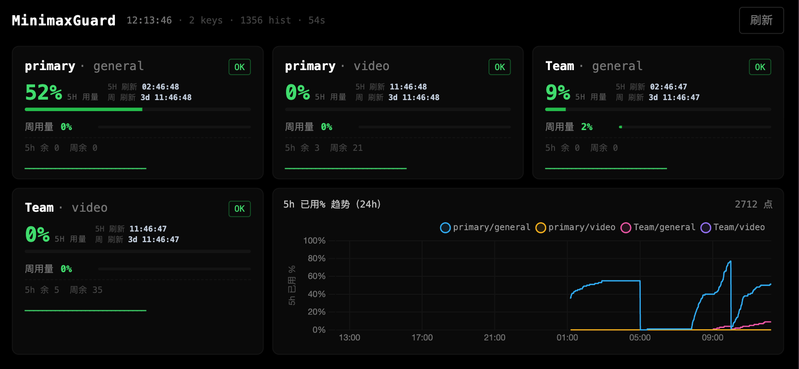

# MinimaxGuard · Minimax 套餐使用量监控

每分钟监测多个 Minimax API key 的 Token Plan 剩余量，提供 **iPhone 友好的深色 Web 仪表板**（含 24h 折线图、WebSocket 秒级实时推送）、**NDJSON 追加式历史数据** 与 **安全的反向代理部署方案**。

> **v0.1.0 重写** —— 后端从 Python/Flask 迁移到 **Node.js + TypeScript + Express** + **ws**。WebSocket 推送替代 60s 轮询，首屏延迟 < 1s。

## 📸 预览



> iPhone / 桌面浏览器友好的深色仪表板：实时 5h/周用量、刷新倒计时、剩余额度、24h 折线趋势图。3+1 卡片布局，折线图与第 4 个卡片同行，自适应填满。

## ✨ 功能

| 维度 | 详情 |
|---|---|
| **轮询** | 每 60s 调用一次 `https://www.minimaxi.com/v1/token_plan/remains` |
| **多 key** | 单配置文件管理多个 Bearer Token，独立 alias |
| **存储** | NDJSON 追加（每行一条 JSON），便于 grep/jq/grep 处理 |
| **Web 仪表板** | 桌面端 + 移动端双视图，dark theme，Chart.js 折线图 |
| **WebSocket 推送** | Node.js `ws` 服务，poller emit `record` → 广播 `usage_update`，首屏 <1s |
| **Key 切换器** | iPhone 顶部下拉选择单 alias / 全部，localStorage 持久化 |
| **访问 key** | 32 字符 URL-safe 随机串，所有 API/WS 路径必须携带 |
| **gzip 压缩** | `compression` 中间件，history 接口 720 kB → ~430 B |
| **容错** | 单 key 失败不影响其他 key；JSON 解析失败跳过该行 |

## 📁 目录结构

```
MinimaxGuard/
├── server/                     # Node.js + TypeScript 后端
│   ├── index.ts                # Express 主程序（API + 静态 + WS 升级）
│   ├── poller.ts               # 60s 后台轮询（EventEmitter）
│   ├── store.ts                # NDJSON 数据访问层
│   ├── utils.ts                # 工具：access key 解析、API 字段映射
│   ├── ws.ts                   # WebSocket 服务
│   └── types.ts                # TypeScript 类型
├── templates/                  # HTML 模板
│   ├── mobile.html             # iPhone 端 SPA（含 <KEY> <BASE_URL> 占位符）
│   ├── mobile2.html            # 同上，路径 /mobile2 强制 iPhone 重新下载
│   └── desktop.html            # 桌面端
├── public/                     # 静态资源
├── dist/                       # TypeScript 编译输出（被 .gitignore 排除）
│
├── config.json                 # API tokens（被 .gitignore 排除，**不入库**）
├── config.example.json         # 示例配置（可入库）
├── data/                       # NDJSON 历史 + access_key（被 .gitignore 排除）
│   ├── usage.ndjson
│   └── access_key              # 32 字符 URL-safe key（chmod 600）
│
├── package.json                # Node 依赖
├── package-lock.json
├── tsconfig.json               # strict: true, ES2022
├── nginx-minimax.conf          # nginx 反代配置片段
│
├── app.py                      # v0.0.0 Python 版（保留作回滚）
├── monitor.py                  # v0.0.0 终端实时面板
├── start.sh                    # v0.0.0 一键启动（Python）
├── requirements.txt
└── README.md
```

## 🚀 快速开始

### 1. 安装依赖

需要 Node.js ≥ 18（推荐 20 LTS）。

```bash
# 安装 Node 20（Ubuntu/Debian）
curl -fsSL https://deb.nodesource.com/setup_20.x | sudo -E bash -
sudo apt-get install -y nodejs

# 或用 binary tarball（不动系统）
curl -fsSL https://nodejs.org/dist/v20.20.2/node-v20.20.2-linux-x64.tar.xz -o /tmp/node.tar.xz
sudo tar -xJf /tmp/node.tar.xz -C /opt
sudo ln -sf /opt/node-v20.20.2-linux-x64/bin/{node,npm,npx} /usr/local/bin/

# 安装项目依赖
cd /path/to/MinimaxGuard
npm install
npm install --save-dev typescript tsx @types/node @types/express @types/compression @types/ws
```

### 2. 配置 API Key

```bash
cp config.example.json config.json
nano config.json
```

```json
{
  "api_url": "https://www.minimaxi.com/v1/token_plan/remains",
  "poll_interval_seconds": 60,
  "request_timeout_seconds": 15,
  "data_file": "data/usage.ndjson",
  "history_limit": 50000,
  "keys": [
    { "alias": "primary", "token": "sk-cp-你的token", "enabled": true },
    { "alias": "backup",  "token": "sk-cp-你的token", "enabled": true }
  ]
}
```

### 3. 编译 + 启动

```bash
# 开发模式（tsx 自动重启 + 类型检查）
npm run dev

# 生产模式
npm run build       # tsc → dist/
npm start           # node dist/index.js
```

启动输出：

```
[init] access key loaded (32 chars)
[init] loaded 2304 historical records from data/usage.ndjson
[poller] started, interval=60s, keys=2
[server] listening on http://127.0.0.1:5060
[server] mobile:   http://127.0.0.1:5060/mobile/<KEY>/
[server] ws:       ws://127.0.0.1:5060/ws?key=<KEY>
```

### 4. nginx 反向代理

`nginx-minimax.conf` 包含完整配置块（`/mobile/`, `/mobile2/`, `/`, `/minimax/`, `/api/`, `/ws`, `/<KEY>/...`）。

关键点：
- WebSocket 必须有 `Upgrade` + `Connection: upgrade` 头
- `/mobile/`, `/mobile2/`, `/minimax/`, `/api/`, `/ws`, `/<KEY>/` 都代理到 5060
- `Cache-Control: no-cache, no-store, must-revalidate` 给所有 API
- `/<KEY>/(.*)` 正则 location 兼容 iPhone 旧 JS 缓存（fetch URL 含 key 段）

详见仓库 `nginx-minimax.conf`。

## 📡 API 端点

| 端点 | 说明 |
|---|---|
| `GET /api/health` | 健康检查（无需 key）|
| `GET /api/keys` | 全部 key 的最新状态（精简）|
| `GET /api/keys?alias=primary` | （未来支持）单 alias 过滤 |
| `GET /api/diag` | poller 状态 + 记录数 + 上次轮询时间 |
| `GET /api/history?limit=2000` | 历史时序数据（默认 full view）|
| `GET /api/history?view=mobile&limit=2000` | 移动端精简视图（仅 5h 窗口的 rp/u）|
| `WS /ws?key=<KEY>` | WebSocket 实时推送 |

### WebSocket 协议

**握手**：`ws://host/ws?key=<KEY>`（带 pre-authed 头；或在首条消息发 `{type:'auth', key}`）

**服务端 → 客户端**：
```json
{ "type": "hello", "auth_required": false }
{ "type": "usage_update", "record": { "alias": "primary", "ts": "2026-06-11T...", "ok": true, "models": [...] } }
```

**客户端 → 服务端**：
```json
{ "type": "subscribe", "aliases": "all" }   // 或 ["primary", "Team"]
{ "type": "request_poll" }                    // 立即触发一次轮询并广播
{ "type": "ping" }                            // 心跳
```

**前端数据流（mobile）**：
1. 启动时 `refresh({withHistory: true})` 拉 24h 历史画图
2. WebSocket 连接后发 `request_poll`，server 立即推一次首屏
3. 每 60s 再 fetch 一次 history（画图新数据点）
4. 真实轮询（每 60s）→ WS push → 增量更新 cards（**不再 fetch**）

## ⚙️ 进阶配置

| 配置项 | 默认 | 说明 |
|---|---|---|
| `poll_interval_seconds` | 60 | 轮询间隔（秒），官方建议 ≥ 30s |
| `request_timeout_seconds` | 15 | 单次 HTTP 请求超时 |
| `data_file` | `data/usage.ndjson` | NDJSON 数据文件路径 |
| `history_limit` | 50000 | 内存中保留的历史条数（≈ 34 天 × 60min × 24 keys）|
| `keys[].alias` | 必填 | 唯一别名 |
| `keys[].token` | 必填 | Bearer Token（`sk-cp-...`）|
| `keys[].tags` | `[]` | 分类标签 |
| `keys[].enabled` | `true` | 是否参与轮询 |

**环境变量**（覆盖默认行为）：

| 变量 | 默认 | 说明 |
|---|---|---|
| `PORT` | 5050 | HTTP/WS 监听端口 |
| `HOST` | 127.0.0.1 | 绑定地址（生产建议 127.0.0.1 + nginx）|
| `CONFIG_PATH` | `config.json` | 配置文件路径 |
| `KEY_FILE` | `data/access_key` | access key 文件路径 |
| `DATA_FILE` | `data/usage.ndjson` | NDJSON 数据路径 |

## 🔐 安全提示

- **不要把 `config.json` 提交到公共仓库**（已加入 `.gitignore`）
- access_key 在 `data/access_key`（chmod 600），**不会**被 .gitignore 误排除（已 explicit 排除）
- WebSocket 鉴权：URL `?key=` 或首条消息 `{type:'auth'}` 二选一
- nginx 反代务必配置 `Cache-Control: no-cache` 给所有 API 响应
- 如果 token 泄露，立即在 Minimax 控制台重置，并删 `data/access_key` 重启服务

## 🛠 生产部署（systemd）

`/etc/systemd/system/minimax-guard-node.service`：

```ini
[Unit]
Description=MinimaxGuard (Node.js + WebSocket)
After=network.target

[Service]
Type=simple
User=root
WorkingDirectory=/opt/MinimaxGuard
Environment=PORT=5060
Environment=HOST=127.0.0.1
ExecStart=/usr/local/bin/node /opt/MinimaxGuard/dist/index.js
Restart=always
RestartSec=5
NoNewPrivileges=true
PrivateTmp=true
ProtectSystem=full
ReadWritePaths=/opt/MinimaxGuard /opt/MinimaxGuard/data
UMask=0077
StandardOutput=journal
StandardError=journal
SyslogIdentifier=minimax-guard-node

[Install]
WantedBy=multi-user.target
```

```bash
sudo systemctl daemon-reload
sudo systemctl enable --now minimax-guard-node
journalctl -u minimax-guard-node -f
```

## 🐛 故障排查

| 现象 | 原因 | 解决 |
|---|---|---|
| `ECONNREFUSED 127.0.0.1:5060` | Node 服务未启动 | `systemctl status minimax-guard-node` |
| iPhone 一直显示旧布局 | Safari HTML 缓存 | 改用新 URL `/mobile2/<KEY>/` 强制重下 |
| WebSocket 连不上 | nginx 没加 `Upgrade` 头 | 确认 `nginx-minimax.conf` 包含 `proxy_set_header Upgrade $http_upgrade` |
| `/<KEY>/api/` 404 | nginx `location /` 兜底 | 确认 nginx 已加载 `location ~ "^/([A-Za-z0-9_-]{16,128})/` 块 |
| 启动报 `config.json: ENOENT` | 未创建 config | `cp config.example.json config.json` 并填 token |
| API 返回 `Not Found` | URL 没带 key | 加 `?key=...` 或 header `X-Access-Key: ...` |

## 🔄 v0.0.0 → v0.1.0 迁移指南

| 项 | v0.0.0 (Python) | v0.1.0 (Node.js) |
|---|---|---|
| HTTP 框架 | Flask 3.1 | Express 4.19 |
| HTTP 客户端 | `requests` | `axios` 1.7 |
| 后台轮询 | `threading.Timer` | `setTimeout` recursive + `EventEmitter` |
| 实时推送 | 60s HTTP 轮询 | **WebSocket** (ws 8.18) |
| 首次数据延迟 | ≤ 60s | **< 1s**（request_poll）|
| history 接口体积 | 720 kB/请求 | **~430 B/请求**（view=mobile + gzip）|
| 部署 | pip + venv | npm + node 20 LTS |
| Docker 镜像大小 | ~150 MB (python:3.12-slim) | ~50 MB (node:20-alpine，未来) |
| systemd 单元 | `python monitor.py` | `node dist/index.js` |
| 默认端口 | 5050 | 5060（避开 Python 版） |

**数据兼容**：NDJSON 格式不变，可直接复用 v0.0.0 的 `data/usage.ndjson`。

**回滚**：保留 v0.0.0 标签，代码仍在 git 历史中可 checkout。

## 📜 版本

- **v0.0.0** —— Python/Flask 基线
- **v0.1.0** —— Node.js + TypeScript + WebSocket 重构

## 📜 许可

仅供个人/团队内部使用，请遵守 Minimax 的服务条款与 API 速率限制。
